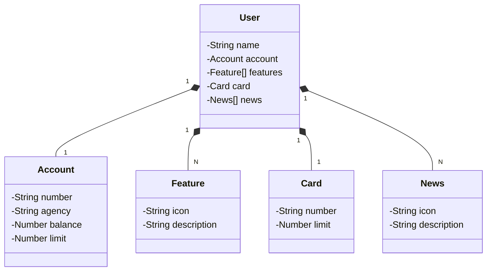

# Santander Dev Week 2023 🚀

API RESTful construída para o **Santander Dev Week 2023**. Um projeto educacional para aprender e aplicar as melhores práticas em desenvolvimento de APIs com Java.

## Principais Tecnologias 🛠️

- **Java 17**: Usamos a versão LTS mais recente do Java para aproveitar os benefícios das últimas inovações da linguagem.
- **Spring Boot 3**: Aproveitamos a produtividade do Spring Boot para criar APIs rápidas e robustas, com autoconfiguração.
- **Spring Data JPA**: Facilitamos a integração com bancos de dados SQL de forma simples e eficiente.
- **OpenAPI (Swagger)**: Criamos uma documentação de API clara e fácil de entender, integrada diretamente ao Spring Boot.
- **Railway**: Usamos o Railway para deploy e monitoramento na nuvem, além de integrar CI/CD e bancos de dados como serviço.

## 📐 [Link do Figma](https://www.figma.com/file/0ZsjwjsYlYd3timxqMWlbj/SANTANDER---Projeto-Web%2FMobile?type=design&node-id=1421%3A432&mode=design&t=6dPQuerScEQH0zAn-1)

O **Figma** foi utilizado para desenhar a arquitetura do projeto, garantindo que todas as funcionalidades e design estivessem alinhados com a proposta da API.

## 🔗 Diagrama de Classes (Domínio da API)

## 🔥 IMPORTANTE

Este projeto foi criado com foco educacional para a DIO. Caso queira uma versão mais robusta, com todos os endpoints de CRUD e boas práticas de desenvolvimento, acesse o repositório oficial da DIO:

### [digitalinnovationone/santander-dev-week-2023-api](https://github.com/digitalinnovationone/santander-dev-week-2023-api)

Na versão oficial, você encontrará:

- Endpoints completos de CRUD.
- Uso de DTOs e práticas recomendadas para um código mais limpo e eficiente.
- Melhor documentação da OpenAPI.

Desafie-se com a versão mais completa! 👊🤩
